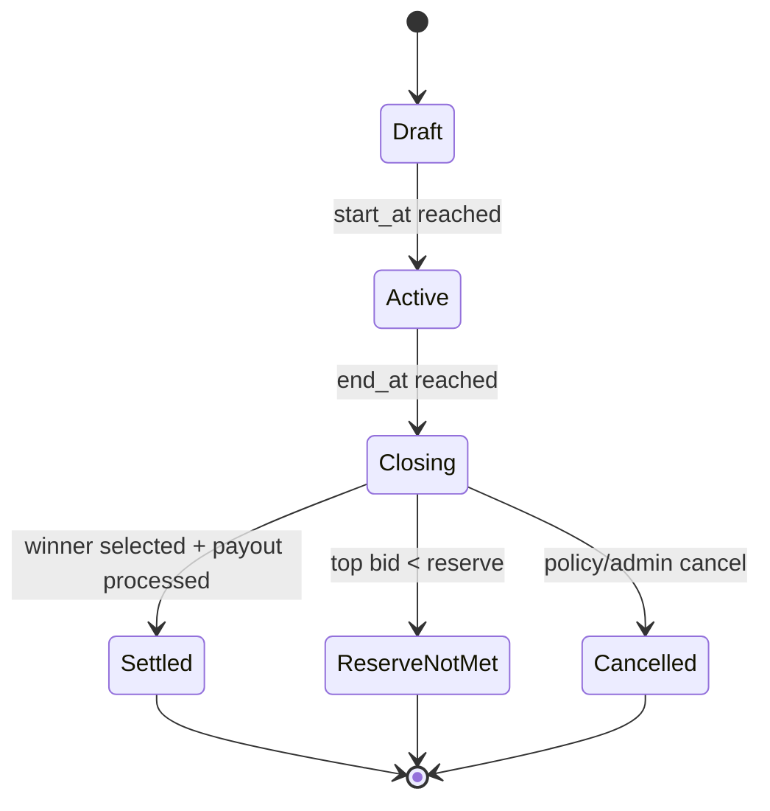
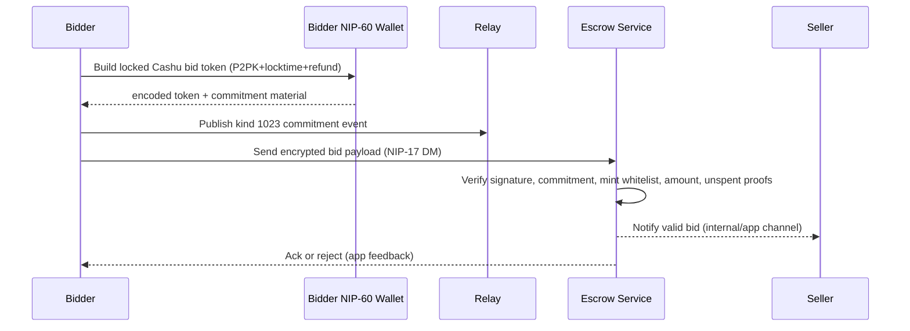
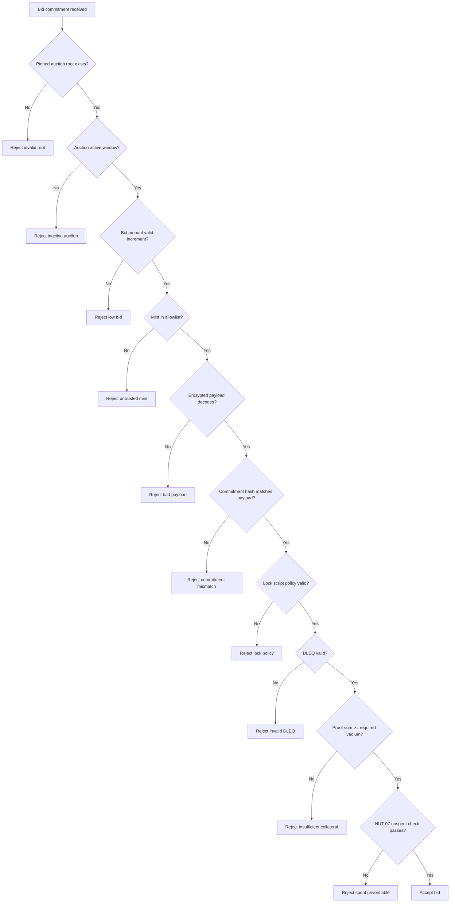
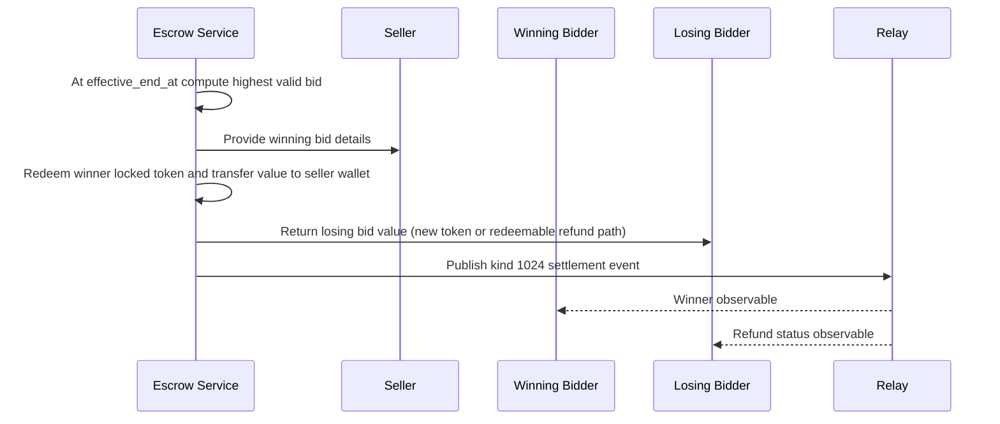

# AUCTIOINS CODEX (Draft)

## 1. Purpose

This document proposes a first auctions scheme for the market protocol using Nostr events plus Cashu as an enforceable bearer-asset bid mechanism.

Goal for v1:

- Standard timed auction (English, ascending, highest bid wins).
- Bid is only valid if backed by actual locked Cashu value (vadium/deposit).
- Non-winning bidders can recover funds.
- Seller defines trusted mints.
- Design remains extensible for additional auction types later.

---

## 2. Scope and Principles

### In scope (v1)

- Limited-time auctions.
- Open bidding.
- Full amount bid-backed deposit (100% vadium by default).
- Cashu lock + refund semantics using NUT-10/NUT-11.
- Relay-visible public bid commitment + private token envelope.

### Out of scope (v1)

- On-chain escrow.
- Complex dispute arbitration.
- Sealed-bid reveal rounds.
- Partial deposit modes (except as a forward-compatible field).

### Security principles

- No informal bids: every valid bid must include spendable value commitment.
- No cleartext token leakage on public relays.
- Mint trust is explicit and seller-controlled.
- Auction closing must be deterministic from immutable root data.

---

## 3. Source Inputs

- Existing marketplace draft spec conventions in `gamma_spec.md` and `SPEC.md`.
- Cashu primitives:
  - NUT-10 (well-known secrets).
  - NUT-11 (P2PK locks, locktime, refund).
  - NUT-14 (HTLC, future extension).
- Local app context:
  - Existing NIP-60 wallet support.
  - Existing ecash flow and trusted mint handling.

---

## 4. Auction Event Model

Kind values below are proposal values for discussion before final NIP/spec assignment.

## 4.1 Kind `30408` Auction Listing (Addressable, updatable)

Signed by seller.

### Required tags

- `d`: auction identifier.
- `title`: display title.
- `a`: product reference (`30402:<seller-pubkey>:<product-d-tag>`) or collection reference.
- `auction_type`: `english` (v1 required).
- `start_at`: unix seconds.
- `end_at`: unix seconds.
- `currency`: `SAT` (v1 required).
- `reserve`: minimum acceptable final price (optional can be `0`, but tag required in v1 for explicitness).
- `bid_increment`: minimum step in sats.
- `mint`: trusted mint URL. MAY repeat.
- `escrow_pubkey`: auction escrow/service pubkey for locked bid handling.
- `settlement_policy`: `cashu_p2pk_v1`.

### Optional tags

- `extension_rule`: e.g. `none` (v1 default), `anti_sniping:<seconds>` (future).
- `vadium_ratio_bps`: default `10000` (100%).
- `schema`: version marker, e.g. `auction_v1`.
- `shipping_option`: if auction is for physical good.
- `key_scheme`: `hd_p2pk`.
- `p2pk_xpub`: required seller/escrow xpub used for per-bid child key derivation.

### Immutable vs mutable tags

Immutable after first publish:

- `auction_type`
- `start_at`
- `end_at`
- `currency`
- `mint` set
- `escrow_pubkey`
- `settlement_policy`

Mutable:

- `title`
- `content` (description)
- media/display metadata

Important:

- Because this is addressable+updatable, clients and platform MUST pin and store the first event ID (`auction_root_event_id`).
- Bids MUST reference `auction_root_event_id`, not only `a` coordinate.
- Updates changing immutable fields MUST be rejected by clients/indexers.

### Example

```jsonc
{
	"kind": 30408,
	"content": "Vintage camera, tested, ships worldwide",
	"tags": [
		["d", "auction-7f0b9a"],
		["title", "Vintage Camera Auction"],
		["a", "30402:<seller-pubkey>:<product-d-tag>"],
		["auction_type", "english"],
		["start_at", "1766202000"],
		["end_at", "1766288400"],
		["currency", "SAT"],
		["reserve", "50000"],
		["bid_increment", "1000"],
		["mint", "https://mint.minibits.cash/Bitcoin"],
		["mint", "https://mint.coinos.io"],
		["escrow_pubkey", "<market-escrow-pubkey>"],
		["settlement_policy", "cashu_p2pk_v1"],
		["schema", "auction_v1"],
	],
}
```

## 4.2 Kind `1023` Auction Bid Commitment (regular event)

Signed by bidder. Public event carries commitment and metadata, not raw token.

### Required tags

- `e`: `<auction_root_event_id>`
- `p`: `<seller_pubkey>`
- `amount`: bid amount in sats.
- `currency`: `SAT`
- `mint`: mint URL for locked token.
- `commitment`: hash commitment over private payload (including token).
- `locktime`: unix seconds used in lock script.
- `refund_pubkey`: bidder refund pubkey.
- `created_for_end_at`: copied auction end timestamp to bind client intent.
- `bid_nonce`: random id per bid.

### Optional tags

- `prev_bid`: previous bid event id from same bidder (replacement chain).
- `note`: short human text.
- `derivation_path`: path used for child pubkey when `key_scheme=hd_p2pk`.
- `child_pubkey`: derived child pubkey actually used in lock.

### Private companion payload (MUST)

Bidder sends encrypted payload to escrow service (and optionally seller) via NIP-17 DM:

- `auction_root_event_id`
- `bid_event_id`
- `cashu_token` (encoded token string)
- `mint`
- `amount`
- `refund_pubkey`
- `lock_script_descriptor`
- `nonce`

Why split:

- Cashu token is bearer value and MUST NOT be posted in clear in public event content.

## 4.3 Kind `1024` Auction Settlement (regular event)

Signed by seller or escrow service key declared by policy.

### Required tags

- `e`: `<auction_root_event_id>`
- `status`: `settled | reserve_not_met | cancelled`
- `close_at`: unix seconds when close was computed.
- `winning_bid`: `<bid_event_id>` or empty if no winner.
- `winner`: `<bidder_pubkey>` or empty.
- `final_amount`: sats (or `0`).

### Optional tags

- `refund`: repeating tags `["refund", "<bid_event_id>", "<bidder_pubkey>", "<status>"]`
- `payout`: proof of payout processing reference.
- `reason`: machine code for cancellation/failure.

---

## 5. Cashu Locking Profile (v1)

## 5.1 Why lock profile is required

A bid without enforceable value is spam. V1 requires a bid token that is cryptographically locked with refund path.

## 5.2 Proposed lock profile: `cashu_p2pk_v1`

Use NUT-11 P2PK secret with:

- lock owner key: `escrow_pubkey` (from auction listing).
- `locktime`: `end_at + settlement_grace_seconds`.
- `refund`: bidder refund pubkey.

`settlement_grace_seconds` default suggestion: 3600 seconds.

This yields:

- Escrow can settle winner before/after end.
- If escrow fails/stalls, bidder can reclaim after locktime using refund key.

Note:

- Direct lock to seller pubkey alone is unsafe for v1 (seller can spend early).
- Seller payout is completed by escrow service after close.

## 5.3 cashu-ts shape

```ts
const { keep, send } = await wallet.send(amount, proofs, {
	p2pk: {
		pubkey: escrowPubkey,
		locktime: endAt + settlementGraceSeconds,
		refundKeys: [bidderRefundPubkey],
	},
})
```

`send` proofs are encoded and delivered only via encrypted channel.

## 5.4 HD custody mode (`hd_p2pk`)

Instead of one static lock key, auctions may use HD-derived per-bid keys.

Flow:

- Auction publishes `key_scheme=hd_p2pk` and `p2pk_xpub`.
- Bidder derives a child pubkey from `p2pk_xpub` + agreed path.
- Bid locks to that child pubkey.
- Seller/escrow derives matching child private key from xpriv and spends winner bid.

Recommended constraints:

- Use non-hardened path levels only if bidders must derive from xpub.
- Never export child private keys or reveal them in logs/UI.
- Do not reuse paths across bids.
- Keep refund+locktime rules unchanged from `cashu_p2pk_v1`.

Recommended derivation root:

- Derive from a dedicated auction HD root stored in seller NIP-60 wallet scope (or equivalent encrypted wallet state).
- Do not derive from seller Nostr identity key (`nsec`) directly.
- Keep key separation: identity signing keys and auction spending keys must be independent.

Seller UX impact:

- One-time setup: enable "HD receive keys" and publish xpub.
- Ongoing auctions: low extra friction if app auto-manages path generation and xpub publication.
- Recovery: seller must back up HD root/seed used for auction xpriv derivation.

---

## 6. Auction State Machine



Deterministic close input set:

- `auction_root_event_id`
- immutable root fields
- all valid bids accepted by the anti-sniping time algorithm
- tie-breaker policy

## 6.1 Effective end time (anti-sniping)

If `extension_rule=anti_sniping:<seconds>` is enabled, clients/indexers compute `effective_end_at` deterministically:

```text
effective_end_at = end_at
for each valid bid ordered by (created_at, id):
  remaining = effective_end_at - bid.created_at
  if 0 < remaining < snipe_threshold_seconds:
    effective_end_at += snipe_extension_seconds
```

Critical policy:

- Settlement MUST use `effective_end_at`, not raw `end_at`.
- Locktime policy MUST account for possible extensions:
  - either conservative locktime at bid creation (recommended), or
  - large enough fixed `settlement_grace_seconds`.

---

## 7. Bid Acceptance Flow



Validation rules (MUST):

- Bid event signature valid.
- Bid references known `auction_root_event_id`.
- Bid time is in active window: `start_at <= created_at <= effective_end_at`.
- Amount satisfies reserve/increment rules.
- Mint is in seller trusted list.
- Encrypted token decodes and commitment matches.
- Locktime policy matches auction rule.
- Refund key is present and correctly bound to bidder.
- DLEQ proofs are valid for declared mint keyset.
- Proofs are unspent at validation time.
- Lock script matches policy (`escrow_pubkey`, locktime, refund pubkey).

## 7.1 Validation pipeline (normative)



Operational notes:

- NUT-07 check SHOULD be retried with bounded timeout.
- If mint is unreachable and policy is strict, bid is rejected.
- If policy is soft-degraded, bid can be marked `tentative` but MUST NOT win until verified.

---

## 8. Auction Close + Settlement + Refund Flow



Tie-break rule (v1):

- Highest `amount` wins.
- If equal amount, earliest `created_at` wins.
- If same `created_at`, lexical smallest bid event ID wins.

## 8.1 Settlement edge cases

- `no_bids`: publish settlement with empty winner fields.
- `reserve_not_met`: publish settlement; all bids follow refund path.
- `cancelled` before first valid bid: allowed.
- `cancelled` after first valid bid: SHOULD be forbidden in v1 policy.
- `winner_default` (deposit mode future): either forfeit vadium or fallback to next valid bid by policy.
- `seller_offline`: bidders recover via refund key after locktime.
- `mint_outage`: settlement should pause/retry; after timeout, emit machine-readable failure reason.

---

## 9. Anti-Abuse and Anti-Scam Guards

## 9.1 Fake bids / spam

- No token => bid invalid.
- Token in public content => reject (security hazard).
- Per-auction bidder rate limits.
- Optional minimum bid floor.
- Optional per-bidder active bid cap (v1 suggestion: 1 active bid per auction).

## 9.2 Fake cashu / invalid proofs

- Validate token format and mint URL.
- Verify mint is trusted by seller.
- Check proof states against mint.
- Reject already-spent or pending-spent proofs.

## 9.3 End-time manipulation

- Immutable `end_at` from root event.
- Root event ID pinned by platform/indexer.
- Bids reference root event ID directly.

## 9.4 Relay race conditions / replay

- Deduplicate by `bid_event_id`.
- Use `commitment` + `bid_nonce`.
- Reject bids arriving after `effective_end_at` even if relay timestamp ordering is odd.

## 9.5 Escrow non-cooperation fallback

- Refund key + locktime path lets bidder recover after timeout.

## 9.6 Critical exclusions (intentionally not adopted)

- Public `proof` tags in bid events:
  - Rejected for v1 because proofs/tokens are bearer assets and public relay exposure is unacceptable.
- Seller-direct lock as mandatory default:
  - Rejected for v1 default due to unilateral early-spend risk.
- Deriving auction spending keys from Nostr identity `nsec`:
  - Rejected. Auction keys and identity keys MUST remain separate.

---

## 10. Extensibility for Other Auction Schemes

Keep these generic fields from day 1:

- `auction_type`: `english | dutch | sealed_first_price | sealed_second_price`
- `bid_visibility`: `open | commit_reveal`
- `price_rule`: `highest_wins | lowest_wins`
- `extension_rule`: `none | anti_sniping:<seconds>`
- `vadium_ratio_bps`: deposit ratio
- `settlement_policy`: lock/payout strategy identifier

V1 MUST enforce:

- `auction_type=english`
- `bid_visibility=open`
- `price_rule=highest_wins`
- `vadium_ratio_bps=10000`

---

## 11. Implementation Notes for This Repo

- Integrate bid lock generation with existing NIP-60 wallet path.
- Add auction schema validators similar to existing `src/lib/schemas/*`.
- Keep a local index keyed by `auction_root_event_id`.
- Persist immutable root snapshot and enforce on updates.
- Add close-job worker that resolves and emits kind `1024`.

## 11.1 Platform responsibilities

- Maintain pinned canonical root event ID for each auction.
- Enforce immutable auction mechanics after first valid bid.
- Compute `effective_end_at` deterministically and expose it in UI.
- Re-verify candidate winning bid proofs shortly before settlement.
- Track settlement deadlines and alert seller/escrow on pending close.

## 11.2 Gamma spec integration

- Auction can reference products with `a:30402:<pubkey>:<d-tag>`.
- Post-auction communication SHOULD use existing encrypted order flow:
  - kind `16` type `1/2/3/4` for order/payment/status/shipping.
  - kind `17` for payment receipts when applicable.
- Physical delivery follows existing shipping option model (`30406`).

---

## 12. Open Decisions Before Spec Merge

1. Confirm kind mapping (`30408` listing, `1023` bid, `1024` settlement) for initial implementation.
2. Whether settlement event must be seller-signed, escrow-signed, or dual-signed.
3. Exact refund transport UX:
   - direct token push to loser
   - loser pull/claim endpoint
   - locktime self-redeem only
4. Default `settlement_grace_seconds`.
5. Whether v1 allows seller cancel after first valid bid (recommended: no).
6. Anti-sniping locktime policy:
   - conservative pre-extension locktime vs fixed grace-only locktime.
7. Mint outage policy:
   - strict reject vs tentative accept for unverified bids.
8. Cross-mint bids:
   - single mint per bid (simpler) vs multi-mint per bid (complex).
9. Minimum auction duration and anti-spam defaults.

---

## 13. Minimal Compliance Checklist (v1)

- Supports kind `30408`, `1023`, `1024` as defined.
- Rejects bids without valid locked value.
- Never publishes raw cashu tokens publicly.
- Enforces mint whitelist.
- Pins immutable root auction event ID and immutable fields.
- Deterministic close and tie-break behavior.
- Emits settlement result and refund status.

## 14. Security model summary

| Threat                 | Mitigation                                            | Residual risk                                     |
| ---------------------- | ----------------------------------------------------- | ------------------------------------------------- |
| Fake bids              | Commitment+payload verification, DLEQ, NUT-07         | Mint downtime can delay verification              |
| End-time tampering     | Root ID pinning + immutable fields                    | Seller can publish confusing shadow updates       |
| Sniping                | Deterministic anti-sniping extension                  | None if enabled and implemented consistently      |
| Double-spend           | Unspent checks before accept and before settlement    | Race window remains between check and final spend |
| Seller fraud           | Escrow-first lock policy + public settlement evidence | Social/reputation layer still required            |
| Escrow non-cooperation | Refund key + locktime recovery path                   | Capital lockup until timeout                      |

## 15. Implementation Appendix (Cashu Examples)

These examples keep bearer tokens out of public bid events. Public bid carries commitment only; token is sent via encrypted NIP-17 payload.

### 15.1 Create bid lock + commitment (bidder)

```ts
import { CashuMint, CashuWallet, getEncodedToken, type Proof } from '@cashu/cashu-ts'
import { sha256 } from '@noble/hashes/sha256'
import { bytesToHex } from '@noble/hashes/utils'

type CreateBidInput = {
	mintUrl: string
	bidAmount: number
	auctionRootEventId: string
	sellerPubkey: string
	lockPubkey: string // escrow pubkey or HD-derived child pubkey
	refundPubkey: string
	locktime: number
	existingProofs: Proof[]
}

export async function createLockedBid(input: CreateBidInput) {
	const mint = new CashuMint(input.mintUrl)
	const wallet = new CashuWallet(mint)
	await wallet.loadMint()

	const { send: lockedProofs, keep: changeProofs } = await wallet.send(input.bidAmount, input.existingProofs, {
		includeDleq: true,
		p2pk: {
			pubkey: input.lockPubkey,
			locktime: input.locktime,
			refundKeys: [input.refundPubkey],
		},
	})

	const cashuToken = getEncodedToken({ mint: input.mintUrl, proofs: lockedProofs })
	const bidNonce = crypto.randomUUID()

	// NOTE: Use canonical JSON in production if available.
	const privatePayload = {
		auction_root_event_id: input.auctionRootEventId,
		amount: input.bidAmount,
		mint: input.mintUrl,
		cashu_token: cashuToken,
		refund_pubkey: input.refundPubkey,
		lock_script_descriptor: {
			pubkey: input.lockPubkey,
			locktime: input.locktime,
		},
		nonce: bidNonce,
	}

	const commitment = bytesToHex(sha256(new TextEncoder().encode(JSON.stringify(privatePayload))))

	const publicBidTags = [
		['e', input.auctionRootEventId],
		['p', input.sellerPubkey],
		['amount', String(input.bidAmount)],
		['currency', 'SAT'],
		['mint', input.mintUrl],
		['commitment', commitment],
		['locktime', String(input.locktime)],
		['refund_pubkey', input.refundPubkey],
		['bid_nonce', bidNonce],
	]

	return { publicBidTags, privatePayload, changeProofs }
}
```

### 15.2 Claim winning bid (seller/escrow)

```ts
import { CashuMint, CashuWallet, type Proof } from '@cashu/cashu-ts'

export async function claimWinningBid(
	mintUrl: string,
	lockedProofs: Proof[],
	spendingPrivkey: string, // escrow/seller key matching lock pubkey
) {
	const mint = new CashuMint(mintUrl)
	const wallet = new CashuWallet(mint)
	await wallet.loadMint()

	return wallet.receive({ mint: mintUrl, proofs: lockedProofs }, { privkey: spendingPrivkey })
}
```

### 15.3 Reclaim losing bid after locktime (bidder)

```ts
import { CashuMint, CashuWallet, type Proof } from '@cashu/cashu-ts'

export async function reclaimExpiredBid(
	mintUrl: string,
	lockedProofs: Proof[],
	refundPrivkey: string, // key matching refund_pubkey
) {
	const mint = new CashuMint(mintUrl)
	const wallet = new CashuWallet(mint)
	await wallet.loadMint()

	return wallet.receive({ mint: mintUrl, proofs: lockedProofs }, { privkey: refundPrivkey })
}
```

### 15.4 Non-negotiable safety rule

- NEVER publish `cashu_token` or raw proofs in kind `1023` public tags/content.
- Only publish commitment + metadata publicly; send token via encrypted payload.
