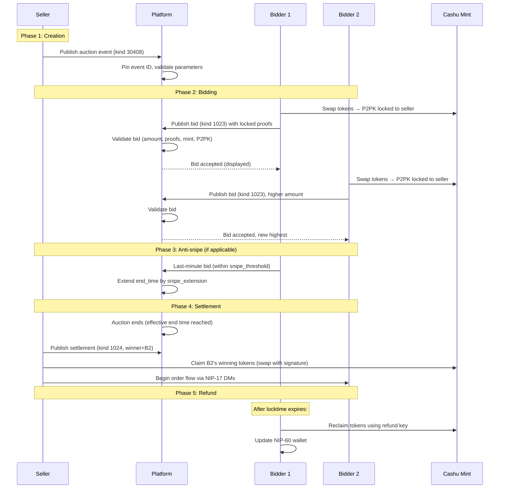
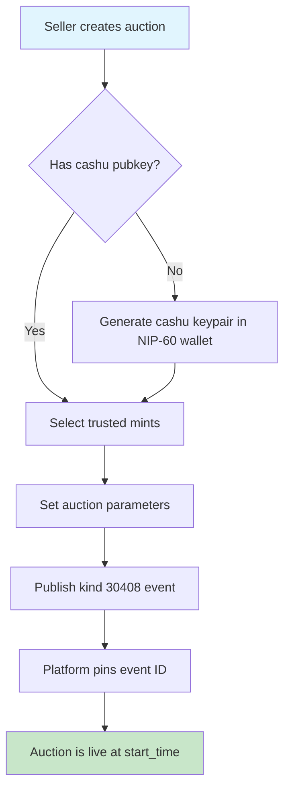
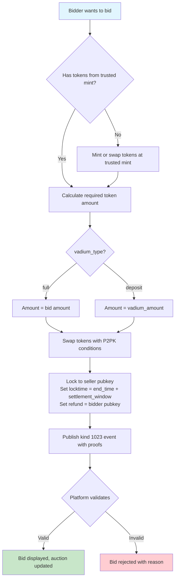
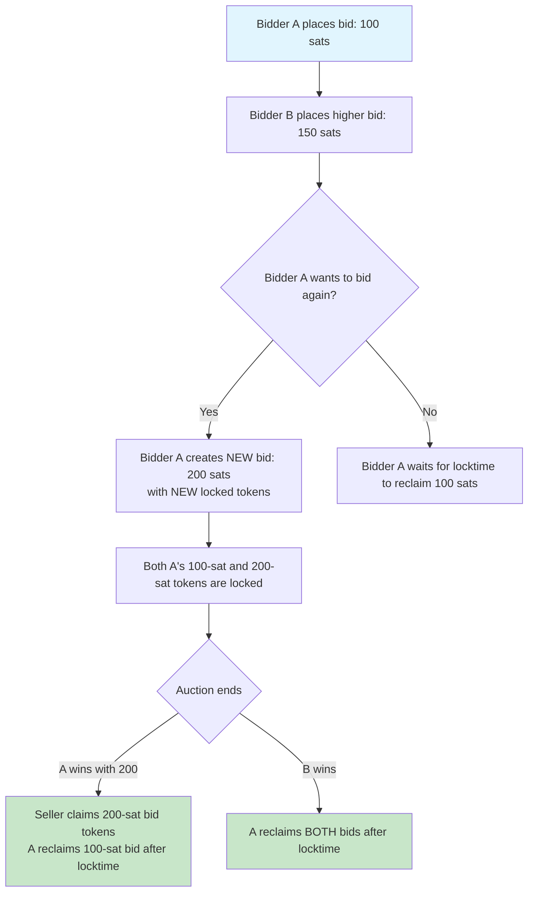
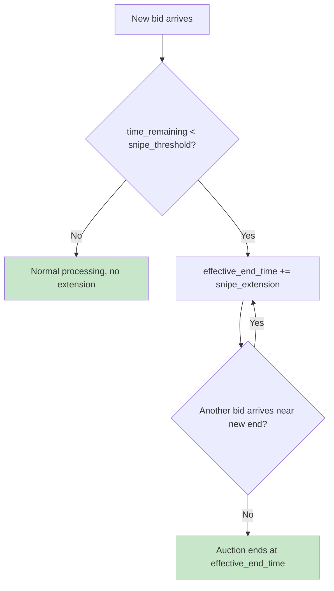
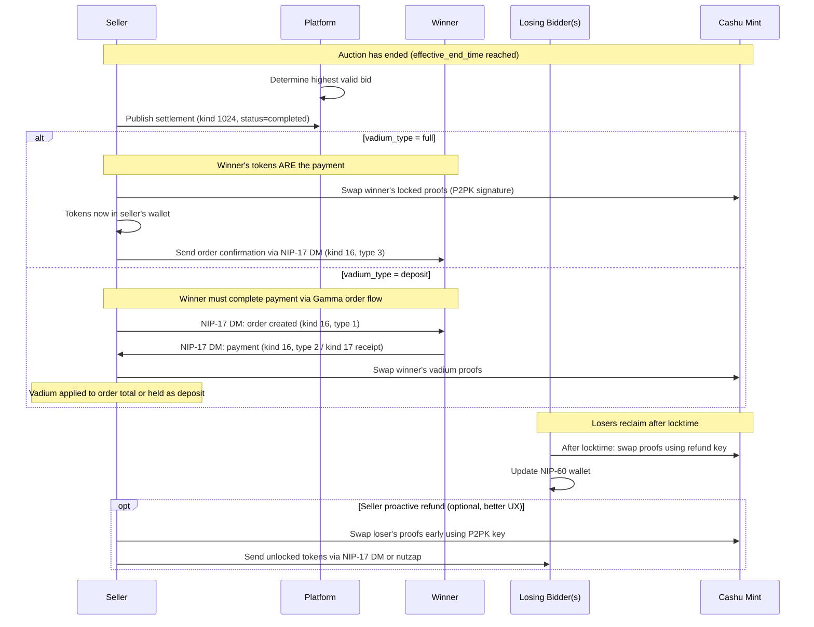
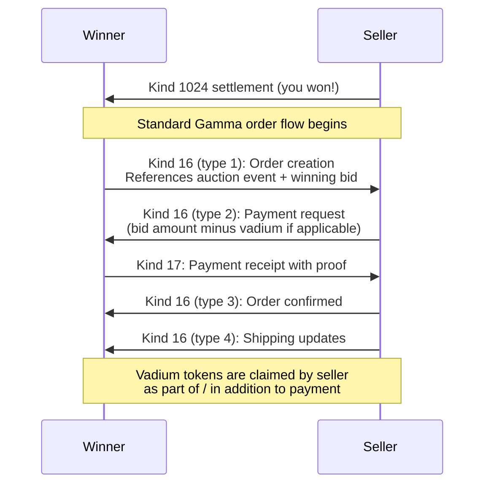
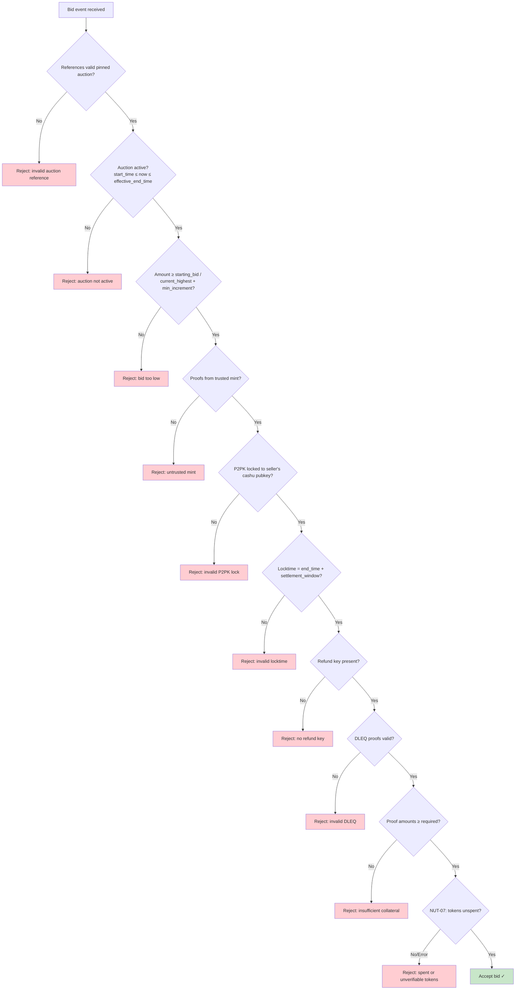

# Auctions Specification for Gamma Markets

`draft` — Pre-implementation design document

## Table of Contents

1. [Overview](#1-overview)
2. [Auction Types](#2-auction-types)
3. [Event Kinds](#3-event-kinds)
4. [Cashu Token Mechanics](#4-cashu-token-mechanics)
5. [Auction Lifecycle](#5-auction-lifecycle)
6. [Anti-Gaming Measures](#6-anti-gaming-measures)
7. [Platform Responsibilities](#7-platform-responsibilities)
8. [Integration with Gamma Spec](#8-integration-with-gamma-spec)
9. [Future Extensions](#9-future-extensions)
10. [Open Questions](#10-open-questions)

---

## 1. Overview

This document specifies a decentralized auction system built on the Nostr protocol, extending the Gamma Markets e-commerce specification. The key innovation is using **cashu ecash tokens** (NUT-11 P2PK locking) as **verifiable, bearer-asset collateral** ("vadium") for bids — eliminating informal bid promises and providing cryptographic guarantees.

### Design Goals

- **Trustless collateral**: Bids contain real money (cashu tokens) locked to the seller's pubkey, not informal promises.
- **Self-custodial refunds**: Losing bidders can reclaim their tokens after a timelock, with no seller cooperation required.
- **Transparency**: English auction bids are public events, verifiable by any observer.
- **Anti-manipulation**: Auction parameters are pinned to a specific event ID, preventing post-creation tampering.
- **Extensibility**: The event structure accommodates multiple auction types (English, Dutch, sealed-bid, etc.).
- **Interoperability**: Integrates with existing Gamma spec order flow (NIP-17 DMs) for post-auction settlement.

### Key Concepts

| Term                     | Definition                                                                                                   |
| ------------------------ | ------------------------------------------------------------------------------------------------------------ |
| **Vadium**               | Earnest money / deposit / collateral. Cashu tokens locked as proof of bid seriousness.                       |
| **P2PK Lock**            | NUT-11 spending condition that locks cashu tokens to a specific public key.                                  |
| **Timelock**             | NUT-11 condition that makes locked tokens reclaimable by a refund key after a unix timestamp.                |
| **Refund Key**           | The bidder's cashu pubkey, included in the token's spending conditions, enabling self-refund after timelock. |
| **Settlement Window**    | Period after auction end during which the seller must claim winning tokens.                                  |
| **Anti-snipe Extension** | Automatic auction extension when bids arrive near the end time.                                              |
| **Event ID Pinning**     | Tracking the original event ID (not the `a` address) to prevent parameter manipulation.                      |

### Prior Art

- **NIP-15 Auctions** (kinds 30020, 1021, 1022): Informal bid system without proof of funds. Bids are just declared amounts with no backing. The seller confirms/rejects bids manually.
- **NIP-61 Nutzaps** (kind 9321): P2PK-locked cashu tokens sent as payments. Establishes the pattern for embedding cashu proofs in Nostr events.
- **NIP-60 Cashu Wallets**: On-protocol wallet state management. Users' cashu tokens live in encrypted Nostr events.

This specification combines the auction lifecycle mechanics of NIP-15 with the cashu proof mechanics of NIP-61 to create a collateral-backed auction system.

---

## 2. Auction Types

The event structure supports multiple auction types via the `auction_type` tag. The initial implementation focuses on **English Ascending** auctions.

### English Ascending (Type: `english`) — **Initial Implementation**

The most common auction format. Ascending bids with a fixed end time.

- Bids are public, ascending.
- Each new bid must exceed the current highest by at least `min_increment`.
- When time expires, the highest bidder wins.
- Anti-snipe extensions may apply.

### Future Types (not implemented initially)

| Type            | Description                                                                                             |
| --------------- | ------------------------------------------------------------------------------------------------------- |
| `dutch`         | Descending price. Seller sets a high start price that decreases over time. First bidder to accept wins. |
| `sealed_first`  | Sealed first-price. Bids are encrypted (NIP-17 DMs). Highest bid wins, pays their bid.                  |
| `sealed_second` | Sealed second-price (Vickrey). Highest bid wins but pays the second-highest price.                      |
| `reserve`       | English with hidden reserve price. Auction only completes if reserve is met.                            |

The `auction_type` tag in the auction event determines which rules apply. Clients MUST reject bids that don't conform to the declared type's rules.

---

## 3. Event Kinds

### 3.1 Auction Listing (Kind: `30408`) — Addressable

Created by the seller to announce an auction. This is an addressable event (has a `d` tag) but the platform pins the **event ID** to prevent parameter manipulation after bids are placed.

**Content**: Auction/product description (markdown allowed)

**Required tags**:

- `d`: Unique auction identifier
- `title`: Auction title for display
- `auction_type`: Type of auction (`english`, `dutch`, `sealed_first`, `sealed_second`, `reserve`)
- `start_time`: Unix timestamp when bidding opens
- `end_time`: Unix timestamp when bidding closes (before any anti-snipe extensions)
- `starting_bid`: Minimum first bid `[<amount>, <currency>]`
- `mint`: Trusted cashu mint URL(s) — MAY appear multiple times. Bids MUST use tokens from one of these mints.
- `unit`: Cashu unit for bids (e.g., `sat`, `usd`)

**Optional tags**:

- Auction Parameters:
  - `min_increment`: Minimum bid increase `[<amount>]` in the auction's unit. Default: 1.
  - `vadium_type`: `full` or `deposit`. Default: `full`.
    - `full`: The cashu tokens in the bid MUST equal the bid amount. Winner's tokens = payment.
    - `deposit`: The cashu tokens in the bid MUST equal the `vadium_amount`. Payment is separate.
  - `vadium_amount`: Required deposit amount (only when `vadium_type` is `deposit`) `[<amount>]`
  - `settlement_window`: Seconds after `end_time` in which the seller must settle. Default: `86400` (24h). This also determines the locktime on cashu tokens.
  - `snipe_threshold`: Seconds before `end_time` that triggers anti-snipe extension. `0` = disabled. Default: `300` (5 min).
  - `snipe_extension`: Seconds to extend when anti-snipe triggers. Default: `300` (5 min).
  - `reserve_price`: Hidden reserve price `[<amount>]` (only for `reserve` type). Not published publicly — seller verifies privately.

- Product Details (inline, following gamma spec product tag conventions):
  - `image`: Product images `[<url>, <dimensions>, <sorting-order>]`, MAY appear multiple times
  - `summary`: Short product description
  - `spec`: Product specifications `[<key>, <value>]`, MAY appear multiple times
  - `type`: Product format `[<format>]` — `digital` or `physical`. Default: `digital`.
  - `weight`: Product weight `[<value>, <unit>]`
  - `dim`: Dimensions `[<l>x<w>x<h>, <unit>]`
  - `t`: Categories/tags, MAY appear multiple times

- Shipping:
  - `shipping_option`: Shipping options `[<30406|30405>:<pubkey>:<d-tag>]`, MAY appear multiple times
  - `location`: Human-readable location
  - `g`: Geohash

- References:
  - `a`: Optional reference to a product listing `30402:<pubkey>:<d-tag>` if the auction is for an existing product
  - `a`: Collection reference `30405:<pubkey>:<d-tag>`, MAY appear multiple times

```jsonc
{
  "kind": 30408,
  "created_at": <unix timestamp>,
  "content": "<product/auction description in markdown>",
  "tags": [
    // Required
    ["d", "<auction-identifier>"],
    ["title", "<auction title>"],
    ["auction_type", "english"],
    ["start_time", "<unix-timestamp>"],
    ["end_time", "<unix-timestamp>"],
    ["starting_bid", "<amount>", "<currency>"],
    ["mint", "<trusted-mint-url-1>"],
    ["mint", "<trusted-mint-url-2>"],  // Multiple mints allowed
    ["unit", "sat"],

    // Auction parameters
    ["min_increment", "<amount>"],
    ["vadium_type", "full"],                        // or "deposit"
    ["vadium_amount", "<amount>"],                  // Only if vadium_type=deposit
    ["settlement_window", "86400"],                 // 24h in seconds
    ["snipe_threshold", "300"],                     // 5 min anti-snipe
    ["snipe_extension", "300"],                     // 5 min extension

    // Product details (inline)
    ["image", "<url>", "<dimensions>", "<sort>"],
    ["summary", "<short description>"],
    ["spec", "<key>", "<value>"],
    ["type", "physical"],

    // Shipping (for physical items)
    ["shipping_option", "30406:<pubkey>:<d-tag>"],
    ["location", "<address>"],

    // Classifications
    ["t", "<category>"],

    // Optional product reference
    ["a", "30402:<pubkey>:<d-tag>"]
  ]
}
```

#### Notes

1. **Event ID Pinning**: The platform MUST store the original `event.id` when the auction is first published. All bid references and end-time calculations use this pinned event. If the seller publishes a new version (same `d` tag), the platform treats the original as canonical for auction mechanics. See [Section 7](#7-platform-responsibilities).

2. **Immutability After First Bid**: Once the first valid bid is received, the auction parameters (end_time, starting_bid, min_increment, trusted mints, vadium settings) are considered immutable. The seller MAY update cosmetic fields (description, images) but MUST NOT change auction mechanics.

3. **Multiple Mints**: Sellers SHOULD list 2-3 trusted mints for bidder flexibility. Listing too many dilutes trust guarantees. Each mint MUST support NUT-11 (P2PK) and NUT-12 (DLEQ proofs).

4. **Currency & Unit**: The `starting_bid` currency (e.g., USD, EUR) is the display currency for the auction price. The `unit` tag specifies the cashu denomination unit (e.g., `sat`, `usd`). The platform handles conversion if these differ.

---

### 3.2 Auction Bid (Kind: `1023`) — Regular

Created by a bidder to place a bid. The event contains cashu proofs (P2PK-locked to the seller) as collateral.

**Content**: Optional human-readable bid note or message.

**Required tags**:

- `e`: Reference to the auction event ID `["e", "<auction-event-id>", "<relay-hint>", "auction"]`
- `amount`: Bid amount in the auction's unit `["amount", "<bid-amount>"]`
- `proof`: One or more cashu proofs, P2PK-locked to seller's pubkey, with DLEQ proof. Each proof is a JSON-stringified cashu proof object. MAY appear multiple times (one per proof).
- `u`: Mint URL the proofs were minted from `["u", "<mint-url>"]`
- `unit`: Token unit `["unit", "sat"]`

```jsonc
{
  "kind": 1023,
  "created_at": <unix timestamp>,
  "pubkey": "<bidder-pubkey>",
  "content": "Optional bid message",
  "tags": [
    // Required
    ["e", "<auction-event-id>", "<relay-hint>", "auction"],
    ["amount", "<bid-amount>"],
    ["proof", "{\"amount\":1,\"C\":\"02...\",\"id\":\"...\",\"secret\":\"[\\\"P2PK\\\",{...}]\",\"dleq\":{...},\"witness\":\"\"}"],
    ["proof", "{\"amount\":2,\"C\":\"02...\",\"id\":\"...\",\"secret\":\"[\\\"P2PK\\\",{...}]\",\"dleq\":{...},\"witness\":\"\"}"],
    // ... more proofs as needed to reach the required amount
    ["u", "<mint-url>"],
    ["unit", "sat"]
  ]
}
```

#### Proof Structure Detail

Each proof's `secret` field MUST be a NUT-10 well-known secret with kind `P2PK`:

```jsonc
[
	"P2PK",
	{
		"nonce": "<random-hex>",
		"data": "<seller-cashu-pubkey>", // 02-prefixed pubkey the seller will use to claim
		"tags": [
			["sigflag", "SIG_INPUTS"],
			["locktime", "<auction-end + settlement-window>"], // Unix timestamp
			["refund", "<bidder-cashu-pubkey>"], // Bidder can reclaim after locktime
		],
	},
]
```

- `data`: The seller's cashu receiving pubkey (from their NIP-60 wallet or kind 10019 event). MUST be `02`-prefixed for nostr↔cashu compatibility.
- `locktime`: MUST be `end_time + settlement_window` (both from the auction event). This gives the seller time to claim the winner's tokens while ensuring all bidders can eventually self-refund.
- `refund`: The bidder's cashu pubkey. After `locktime`, the bidder can spend these tokens using their refund key.

#### Validation Rules

Clients and the platform MUST validate bids:

1. The `e` tag references a valid, active auction event ID.
2. The auction has started (`created_at >= start_time`) and not ended (accounting for snipe extensions).
3. The `amount` is >= `starting_bid` (if first bid) or >= `current_highest + min_increment`.
4. All proofs are from a mint listed in the auction's `mint` tags.
5. The sum of proof amounts >= declared `amount` (if `vadium_type=full`) or >= `vadium_amount` (if `vadium_type=deposit`).
6. Each proof's P2PK secret locks to the seller's cashu pubkey.
7. Each proof has a valid `locktime` matching `end_time + settlement_window`.
8. Each proof has a `refund` tag with the bidder's cashu pubkey.
9. DLEQ proofs are present and valid (NUT-12 offline verification).
10. Token state check: proofs are unspent (NUT-07, requires mint query — MAY be deferred).

---

### 3.3 Auction Settlement (Kind: `1024`) — Regular

Created by the seller (or platform on seller's behalf) to announce auction results.

**Content**: Optional human-readable settlement message.

**Required tags**:

- `e`: Reference to the auction event ID `["e", "<auction-event-id>", "<relay-hint>", "auction"]`
- `status`: Auction outcome: `completed`, `cancelled`, `reserve_not_met`, `no_bids`

**Conditional tags** (when `status=completed`):

- `winner`: Winning bidder's pubkey `["winner", "<bidder-pubkey>"]`
- `e`: Reference to the winning bid event `["e", "<winning-bid-event-id>", "<relay-hint>", "winner"]`
- `amount`: Final sale price `["amount", "<winning-amount>"]`

```jsonc
{
  "kind": 1024,
  "created_at": <unix timestamp>,
  "pubkey": "<seller-pubkey>",
  "content": "Auction completed. Congratulations to the winner!",
  "tags": [
    ["e", "<auction-event-id>", "<relay-hint>", "auction"],
    ["status", "completed"],
    ["winner", "<winning-bidder-pubkey>"],
    ["e", "<winning-bid-event-id>", "<relay-hint>", "winner"],
    ["amount", "<winning-amount>"]
  ]
}
```

#### Settlement Statuses

| Status            | Meaning                                                          |
| ----------------- | ---------------------------------------------------------------- |
| `completed`       | Auction ended successfully, winner determined.                   |
| `cancelled`       | Seller cancelled the auction (ideally before first bid).         |
| `reserve_not_met` | Highest bid did not meet reserve price. All bids are refundable. |
| `no_bids`         | Auction ended with zero valid bids.                              |

---

## 4. Cashu Token Mechanics

### 4.1 P2PK Locking (NUT-11)

Cashu tokens are locked using NUT-11 Pay-to-Public-Key spending conditions. This is the cryptographic foundation of the auction's collateral system.

```
┌─────────────────────────────────────────────────────────┐
│                  Cashu Proof (Locked)                    │
├─────────────────────────────────────────────────────────┤
│  amount: 100                                            │
│  id: "00abc123"          (mint keyset ID)               │
│  C: "02..."              (blind signature)              │
│  secret: ["P2PK", {                                     │
│    nonce: "<random>",                                   │
│    data: "<seller-pubkey>",    ← Primary lock           │
│    tags: [                                              │
│      ["sigflag", "SIG_INPUTS"],                         │
│      ["locktime", "1735689600"],  ← Auto-unlock time    │
│      ["refund", "<bidder-pubkey>"] ← Fallback recipient │
│    ]                                                    │
│  }]                                                     │
│  dleq: { ... }           (offline verifiability)        │
└─────────────────────────────────────────────────────────┘

Before locktime:  ONLY seller can spend (needs seller's privkey signature)
After locktime:   ONLY bidder can spend (needs bidder's refund privkey signature)
```

### 4.2 Token Lifecycle

```
   Bidder's NIP-60 Wallet
          │
          ▼
   ┌──────────────┐     Swap at mint with P2PK conditions
   │ Unlocked     │ ──────────────────────────────────────►  ┌──────────────┐
   │ Tokens       │     (locks to seller pubkey +            │ P2PK-Locked  │
   │ (spendable)  │      locktime + refund key)              │ Tokens       │
   └──────────────┘                                          └──────┬───────┘
                                                                    │
                                                         Published in bid event
                                                            (kind 1023)
                                                                    │
                                              ┌─────────────────────┼──────────────────┐
                                              │                     │                  │
                                         If WINNER            If OUTBID          If AUCTION
                                              │               (before end)        EXPIRED
                                              ▼                     │                  │
                                    ┌──────────────┐               │                  │
                                    │ Seller claims│               │                  │
                                    │ (swaps at    │               ▼                  ▼
                                    │  mint with   │      ┌──────────────┐   ┌──────────────┐
                                    │  signature)  │      │ Wait for     │   │ After        │
                                    └──────────────┘      │ locktime OR  │   │ locktime:    │
                                                          │ seller refund│   │ bidder       │
                                                          └──────────────┘   │ self-refunds │
                                                                             └──────────────┘
```

### 4.3 Locktime Calculation

The locktime on all bid tokens for a given auction MUST be:

```
locktime = auction.end_time + auction.settlement_window
```

Where:

- `end_time` is from the **original** (pinned) auction event
- `settlement_window` defaults to 86400 seconds (24 hours)

This means:

- The seller has `settlement_window` seconds after the auction ends to claim the winning bid.
- ALL bidders (including losers) can reclaim their tokens after `locktime`.
- If the seller never claims (goes offline, loses keys), no funds are permanently lost.

**Anti-snipe extension and locktime**: If anti-snipe extensions are active, the "effective end time" may be later than the declared `end_time`. However, the **locktime on tokens is still calculated from the original `end_time`**. This means the settlement window shrinks if extensions trigger. Sellers SHOULD set a generous `settlement_window` to account for this. Future iterations may adjust this (see [Open Questions](#10-open-questions)).

### 4.4 Trusted Mints

The seller MUST declare one or more trusted mints in their auction event via `mint` tags. Requirements for listed mints:

1. MUST support **NUT-10** (Spending Conditions)
2. MUST support **NUT-11** (P2PK)
3. MUST support **NUT-12** (DLEQ Proofs) — for offline token verification
4. SHOULD support **NUT-07** (Token State Check) — for online spend verification

Bidders MUST use tokens from a listed mint. Bids with tokens from unlisted mints are invalid.

Sellers SHOULD:

- List 2-3 well-known, reputable mints for bidder convenience.
- Verify mints support required NUTs before listing them.
- Consider mint liquidity (bidders need to be able to swap into these mints).

### 4.5 Token Verification

Verification can be performed by any observer (clients, platform, other bidders):

**Offline verification** (no mint contact needed):

1. Parse proof's `secret` field, verify it's a valid NUT-10 P2PK secret.
2. Verify `data` matches the seller's declared cashu pubkey.
3. Verify `locktime` matches `end_time + settlement_window`.
4. Verify `refund` contains a valid pubkey.
5. Verify DLEQ proof (NUT-12) against the mint's public keyset.

**Online verification** (requires mint contact): 6. Query mint's NUT-07 endpoint to check token spend state (UNSPENT, PENDING, SPENT).

Offline verification is sufficient for most purposes. Online verification (step 6) provides additional assurance but introduces latency and mint availability dependency.

### 4.6 Seller's Cashu Pubkey

The seller MUST have a cashu-specific pubkey for receiving P2PK-locked tokens. This is NOT the seller's Nostr pubkey. Following NIP-60/NIP-61 conventions:

- The seller's cashu privkey is stored encrypted in their NIP-60 `kind:17375` wallet event.
- The corresponding pubkey can be published in the seller's `kind:10019` event (NIP-61 mint recommendation).
- The pubkey MUST be `02`-prefixed for nostr↔cashu compatibility.

Bidders discover the seller's cashu pubkey from:

1. The seller's `kind:10019` event (`pubkey` tag), OR
2. A dedicated tag in the auction event (for convenience)

For simplicity, the auction event SHOULD include a `p2pk_pubkey` tag:

```jsonc
["p2pk_pubkey", "<02-prefixed-seller-cashu-pubkey>"]
```

---

## 5. Auction Lifecycle

### 5.1 High-Level Flow



### 5.2 Auction Creation Flow



### 5.3 Bid Placement Flow



### 5.4 Outbid Scenario

When a bidder is outbid, their tokens remain locked until the locktime expires. The bidder has two options:

1. **Wait for locktime**: After `end_time + settlement_window`, use their refund key to reclaim tokens. No seller cooperation needed.
2. **Seller proactive refund** (optional, better UX): The seller swaps the outbid tokens at the mint (using their P2PK key) and sends new, unlocked tokens back to the bidder via NIP-17 DM or nutzap (kind 9321).

If the bidder wants to bid again (higher), they must submit a **new bid** with **new tokens**. The previous bid's tokens remain locked. This means bidders should account for capital lockup when planning bids.



### 5.5 Anti-Snipe Extension

Prevents last-second bid sniping by automatically extending the auction when bids arrive near the end.



The effective end time is computed deterministically by any client:

```
effective_end_time = end_time
for each valid bid B ordered by created_at:
    time_remaining = effective_end_time - B.created_at
    if time_remaining < snipe_threshold AND time_remaining > 0:
        effective_end_time += snipe_extension
```

Since this is deterministic based on public data (auction event + bid events), any client can independently compute the same `effective_end_time`. No event updates are needed.

### 5.6 Settlement Flow



### 5.7 Winner Payment Flow (Vadium Mode)

When `vadium_type=deposit`, the auction winner must complete payment through the standard Gamma spec order flow:



### 5.8 Cancellation & Edge Cases

#### Seller Cancels Before Any Bids

- Seller publishes settlement (kind 1024, `status=cancelled`).
- No tokens to refund.
- Seller SHOULD publish a new version of the auction event with `visibility=hidden` or delete it (NIP-09).

#### Seller Cancels After Bids Placed

- Seller publishes settlement (kind 1024, `status=cancelled`).
- ALL bidders' tokens become reclaimable after locktime.
- Seller SHOULD proactively refund all bidders.
- Platform SHOULD flag this seller for poor behavior.

#### Winner Defaults (Vadium Mode)

- Winner doesn't complete payment within a reasonable time.
- Seller claims vadium as compensation.
- Seller MAY award to the second-highest bidder by publishing a new settlement.
- Seller MAY relist the item.

#### Seller Goes Offline

- Seller never publishes a settlement or claims tokens.
- ALL bidders reclaim their tokens after locktime via refund keys.
- No funds are permanently lost (this is the key safety property of the timelock design).

#### Disputed Results

- Since bids are public and verifiable, any observer can independently determine the valid highest bid.
- If the seller announces a wrong winner, the community can verify.
- The platform SHOULD validate settlement events against the bid history.

---

## 6. Anti-Gaming Measures

### 6.1 Fake Bids / Insufficient Funds

**Threat**: Bidder publishes a bid event with invalid or already-spent cashu tokens.

**Mitigation**:

- **DLEQ verification** (NUT-12): Any observer can verify proofs are valid signatures from the mint, offline.
- **Token state check** (NUT-07): Platform queries the mint to verify tokens are unspent.
- **Amount validation**: Platform verifies sum of proof amounts >= required amount.
- **P2PK validation**: Platform verifies proofs are locked to the correct seller pubkey with correct locktime.

### 6.2 Shill Bidding

**Threat**: Seller uses alt accounts to drive up the price.

**Mitigation**:

- All bids contain real cashu tokens — shill bidding has a real cost (tokens are locked until locktime).
- Nostr identity reputation systems help identify suspicious patterns.
- Platform can analyze bidding patterns (new accounts, bid timing, amounts).
- Full transparency: all bids are public events, auditable by anyone.

### 6.3 Bid Sniping

**Threat**: Bidder waits until the last second to place a winning bid, preventing counter-bids.

**Mitigation**:

- **Anti-snipe extension**: Configurable per auction (`snipe_threshold` + `snipe_extension`).
- Deterministic computation: any client can verify the effective end time.

### 6.4 Seller Manipulation

**Threat**: Seller changes auction end time or parameters after bids are placed.

**Mitigation**:

- **Event ID pinning**: Platform tracks the original event ID, not the `a` address.
- Bids reference the event ID via `e` tag — updating the auction orphans existing bids from the new version.
- Platform rejects parameter changes to pinned auctions after first bid.

### 6.5 Token Double-Spending

**Threat**: Bidder uses the same cashu tokens in multiple bids (on this auction or others).

**Mitigation**:

- **NUT-07 state check**: Platform checks tokens are UNSPENT before accepting a bid.
- **Periodic re-checks**: Platform can periodically re-verify token states during the auction.
- If tokens are found to be spent (double-spend attempt), the bid is invalidated and removed.

### 6.6 Spam Bids

**Threat**: Flooding the auction with low-value bids to disrupt or grief.

**Mitigation**:

- Every bid requires locking real cashu tokens — spam has a real cost.
- Minimum bid increment (`min_increment`) prevents trivial bid increases.
- Platform can rate-limit bid events per pubkey.
- `starting_bid` sets a minimum threshold.

### 6.7 Seller Claims All Tokens (Rug Pull)

**Threat**: Seller claims all bidders' tokens, not just the winner's.

**Mitigation**:

- **Timelock safety net**: After `locktime`, ALL bidders can reclaim via refund keys regardless of seller behavior. The worst case is that bidders wait longer, not that funds are permanently lost.
- **Public accountability**: All bids and settlements are public. A seller claiming non-winner tokens is provably malicious.
- **Reputation damage**: Verifiable fraud destroys the seller's Nostr identity reputation.
- **Vadium mode**: In `vadium_type=deposit`, the locked amount is limited, reducing the rug pull incentive.
- **Future**: Multi-sig escrow (platform + seller) could be used for high-value auctions (see [Section 9](#9-future-extensions)).

---

## 7. Platform Responsibilities

The platform (our marketplace application) serves as a facilitator and validator, NOT as a custodian or trusted party.

### 7.1 Event ID Pinning

When a new auction (kind 30408) is published:

1. Store the `event.id` as the canonical auction identifier.
2. Index auction parameters from this specific event.
3. ALL subsequent operations (bid validation, end time calculation, settlement) reference this pinned ID.
4. If the seller publishes an updated version (same `d` tag, new event ID):
   - Display updated cosmetic content (description, images) — optional.
   - NEVER update auction-critical parameters (end_time, starting_bid, etc.) from the new version.
   - Continue using the pinned event ID for all auction mechanics.

### 7.2 Bid Validation Pipeline

For each incoming bid (kind 1023):



### 7.3 End Time Management

The platform computes and displays the effective end time:

```
effective_end_time = pinned_auction.end_time
for each accepted bid B (ordered by created_at):
    remaining = effective_end_time - B.created_at
    if 0 < remaining < pinned_auction.snipe_threshold:
        effective_end_time += pinned_auction.snipe_extension
```

This computation is deterministic and verifiable by any client.

### 7.4 Post-Auction Duties

1. **Determine winner**: Highest valid bid at effective end time.
2. **Notify seller**: The platform SHOULD prompt the seller to publish a settlement (kind 1024).
3. **Initiate order flow**: If `vadium_type=full`, trigger order confirmation. If `vadium_type=deposit`, initiate payment request.
4. **Monitor token state**: Periodically check that winning bid tokens haven't been reclaimed (seller should claim promptly).

---

## 8. Integration with Gamma Spec

### 8.1 Relationship to Products (Kind 30402)

Auctions MAY reference an existing product listing:

```jsonc
["a", "30402:<seller-pubkey>:<product-d-tag>"]
```

If referenced, the product event provides detailed product metadata. The auction event may duplicate key fields (title, images) for standalone rendering. There is **no inheritance** — consistent with the gamma spec's no-cascading principle.

If no product is referenced, the auction event is self-contained with inline product details.

### 8.2 Post-Auction Order Flow

After the auction settles, the winner and seller enter the standard Gamma spec order communication:

1. **`vadium_type=full`**: Winner's cashu tokens are the payment. Seller claims them and sends an order status (kind 16, type 3, status `confirmed`). For physical goods, shipping updates follow (kind 16, type 4).

2. **`vadium_type=deposit`**: Winner initiates an order (kind 16, type 1) referencing the auction. The order amount is the winning bid minus the vadium (or the full amount, with vadium returned separately — seller's discretion). Standard payment flow follows.

### 8.3 Shipping

Physical goods use the same shipping option system as the gamma spec. The auction event can include `shipping_option` tags referencing kind 30406 events. The winner selects a shipping option during the order flow.

### 8.4 Reviews

After fulfillment, the buyer can leave a review (kind 31555) referencing the product (if linked) following the standard gamma spec review format.

---

## 9. Future Extensions

### 9.1 Dutch Auctions

Descending price with a `price_decrement` and `decrement_interval`:

```jsonc
["auction_type", "dutch"],
["starting_bid", "10000", "sat"],
["floor_price", "1000", "sat"],
["price_decrement", "100"],
["decrement_interval", "60"]  // seconds
```

First bidder to accept the current price wins. Bid amount in the event should match the current price at bid time.

### 9.2 Sealed-Bid Auctions

Bids are encrypted NIP-17 DMs (kind 14/16) to the seller instead of public events. The seller publishes the settlement (kind 1024) with the winner after the deadline. Verification is harder — may require commit-reveal schemes or trusted platform validation.

### 9.3 Multi-sig Escrow

For high-value auctions, tokens could be locked with `n_sigs=2` requiring both seller and platform signatures:

```jsonc
[
	"P2PK",
	{
		"data": "<seller-pubkey>",
		"tags": [
			["pubkeys", "<platform-pubkey>"],
			["n_sigs", "2"],
			["locktime", "<...>"],
			["refund", "<bidder-pubkey>"],
		],
	},
]
```

This prevents the seller from unilaterally claiming losing bids while still allowing the platform to co-sign the winner's claim.

### 9.4 HTLC-Based Bidding (NUT-14)

Instead of P2PK, bids could use Hash Time-Lock Contracts:

- Lock: `hash(preimage)` + seller pubkey + locktime
- Winner claim: seller reveals preimage (publicly) to claim
- Loser refund: automatic after locktime

Advantage: seller can only claim ONE bid (once preimage is public, it proves which bid was claimed). However, the preimage revelation is public, which may have privacy implications.

### 9.5 Automatic Outbid Refunds

Platform or seller-operated service that automatically swaps and returns outbid tokens, reducing capital lockup for active bidders.

### 9.6 Reserve Price Verification

For `reserve` type auctions, use a commit-reveal scheme:

1. Seller publishes `hash(reserve_price || nonce)` in the auction event.
2. After auction ends, seller reveals `reserve_price` and `nonce`.
3. Anyone can verify `hash(reserve_price || nonce)` matches.

---

## 10. Open Questions

### Q1: Anti-snipe vs Locktime Mismatch

Currently, the locktime is calculated from the declared `end_time`, but anti-snipe extensions push the effective end time later. This means the settlement window shrinks for auctions with many snipe extensions.

**Options**:

- (a) Accept shorter settlement window (seller should set generous `settlement_window` to absorb this).
- (b) Require locktime to be `end_time + max_possible_extensions + settlement_window` (more conservative, bidders lock funds longer).
- (c) Use a separate "max_auction_duration" that covers worst-case extensions.

### Q2: Outbid Token Lockup Cost

Bidders who are outbid have tokens locked until `locktime`. If they want to bid again, they need additional funds. This could discourage active bidding.

**Options**:

- (a) Accept it (keep it simple, tokens are safe and reclaimable).
- (b) Seller-assisted refund (optional, better UX).
- (c) Platform-assisted refund service.
- (d) Allow "bid replacement" where the new bid references the old one and the seller swaps atomically.

### Q3: Seller Cashu Pubkey Discovery

How should bidders reliably discover the seller's cashu pubkey?

**Options**:

- (a) From `kind:10019` event (NIP-61 standard).
- (b) From a dedicated `p2pk_pubkey` tag in the auction event.
- (c) Both (redundant but convenient).

### Q4: Cross-Mint Bidding

Should bidders be able to bid with tokens from different mints in the same bid event? (Multiple `u` tags, proofs from different mints.)

**Options**:

- (a) Single mint per bid (simpler validation).
- (b) Multiple mints per bid (more flexible, complex validation).

### Q5: Minimum Bid Duration

Should the spec mandate a minimum auction duration to prevent flash auctions that could be gamed?

### Q6: Token Denomination / Change

If a bidder's available tokens don't split evenly to the exact bid amount, how is change handled? The swap at the mint handles this (mint returns change proofs), but the bidder needs to ensure the locked amount exactly matches the required amount.

### Q7: What if the Mint Goes Down?

If a trusted mint goes offline during the auction:

- Existing bids with proofs from that mint can't be verified (NUT-07).
- The seller can't claim tokens from that mint.
- Bidders can't reclaim tokens.

This is a fundamental risk of cashu. Mitigation: use reputable mints, allow multiple mints, keep auction durations reasonable.

---

## Appendix A: Example Events

### A.1 Auction Listing

```jsonc
{
	"id": "abc123...",
	"kind": 30408,
	"pubkey": "<seller-nostr-pubkey>",
	"created_at": 1735600000,
	"content": "Rare vintage mechanical keyboard in excellent condition. Cherry MX Blue switches, full ANSI layout.",
	"tags": [
		["d", "vintage-keyboard-001"],
		["title", "Vintage Cherry MX Mechanical Keyboard"],
		["auction_type", "english"],
		["start_time", "1735686400"],
		["end_time", "1735772800"],
		["starting_bid", "5000", "sat"],
		["min_increment", "500"],
		["unit", "sat"],
		["mint", "https://mint.minibits.cash/Bitcoin"],
		["mint", "https://stablenut.umint.cash"],
		["vadium_type", "full"],
		["settlement_window", "86400"],
		["snipe_threshold", "300"],
		["snipe_extension", "300"],
		["p2pk_pubkey", "02eaee8939e3565e48cc62967e2fde9d8e2a4b3ec0081f29eceff5c64ef10ac1ed"],
		["image", "https://example.com/keyboard1.jpg", "800x600", "0"],
		["image", "https://example.com/keyboard2.jpg", "800x600", "1"],
		["summary", "Rare vintage Cherry MX Blue mechanical keyboard"],
		["type", "physical"],
		["spec", "switch-type", "Cherry MX Blue"],
		["spec", "layout", "ANSI Full"],
		["spec", "condition", "Excellent"],
		["shipping_option", "30406:<seller-pubkey>:standard-shipping"],
		["t", "keyboards"],
		["t", "vintage"],
		["t", "mechanical"],
	],
}
```

### A.2 Auction Bid

```jsonc
{
	"id": "bid789...",
	"kind": 1023,
	"pubkey": "<bidder-nostr-pubkey>",
	"created_at": 1735700000,
	"content": "",
	"tags": [
		["e", "abc123...", "wss://relay.example.com", "auction"],
		["amount", "7500"],
		[
			"proof",
			"{\"amount\":4,\"C\":\"02698c4e2b5f9534cd0687d87513c759790cf829aa5739184a3e3735471fbda904\",\"id\":\"009a1f293253e41e\",\"secret\":\"[\\\"P2PK\\\",{\\\"nonce\\\":\\\"b00bdd0467b0090a25bdf2d2f0d45ac4e355c482c1418350f273a04fedaaee83\\\",\\\"data\\\":\\\"02eaee8939e3565e48cc62967e2fde9d8e2a4b3ec0081f29eceff5c64ef10ac1ed\\\",\\\"tags\\\":[[\\\"sigflag\\\",\\\"SIG_INPUTS\\\"],[\\\"locktime\\\",\\\"1735859200\\\"],[\\\"refund\\\",\\\"03aabbcc...\\\"]]}]\",\"dleq\":{\"e\":\"...\",\"s\":\"...\",\"r\":\"...\"}}",
		],
		["proof", "{\"amount\":2,\"C\":\"...\",\"id\":\"...\",\"secret\":\"...\",\"dleq\":{...}}"],
		["proof", "{\"amount\":1,\"C\":\"...\",\"id\":\"...\",\"secret\":\"...\",\"dleq\":{...}}"],
		["u", "https://mint.minibits.cash/Bitcoin"],
		["unit", "sat"],
	],
}
```

Note: The `locktime` in each proof's secret is `1735859200` = `end_time (1735772800) + settlement_window (86400)`.

### A.3 Auction Settlement

```jsonc
{
	"id": "settle456...",
	"kind": 1024,
	"pubkey": "<seller-nostr-pubkey>",
	"created_at": 1735772900,
	"content": "Auction completed! Congratulations to the winner.",
	"tags": [
		["e", "abc123...", "wss://relay.example.com", "auction"],
		["status", "completed"],
		["winner", "<winning-bidder-pubkey>"],
		["e", "bid789...", "wss://relay.example.com", "winner"],
		["amount", "7500"],
	],
}
```

---

## Appendix B: Cashu Token Swap for Bidding (Implementation Reference)

Using `cashu-ts`, the bid token creation flow:

```typescript
import { CashuMint, CashuWallet, getEncodedTokenV4 } from '@cashu/cashu-ts'

async function createBidTokens(
	mintUrl: string,
	bidAmount: number,
	sellerCashuPubkey: string, // 02-prefixed
	auctionEndTime: number, // unix timestamp
	settlementWindow: number, // seconds
	bidderCashuPubkey: string, // 02-prefixed, for refund
	existingProofs: Proof[], // from bidder's NIP-60 wallet
) {
	const mint = new CashuMint(mintUrl)
	const wallet = new CashuWallet(mint)
	await wallet.loadMint()

	const locktime = auctionEndTime + settlementWindow

	// Swap existing proofs into P2PK-locked proofs
	const { send: lockedProofs, keep: changeProofs } = await wallet.send(bidAmount, existingProofs, {
		includeDleq: true,
		p2pk: {
			pubkey: sellerCashuPubkey,
			locktime: locktime,
			refundKeys: [bidderCashuPubkey],
		},
	})

	// lockedProofs → include in bid event as "proof" tags
	// changeProofs → return to bidder's NIP-60 wallet
	return { lockedProofs, changeProofs }
}
```

Seller claiming winning tokens:

```typescript
async function claimWinningBid(
	mintUrl: string,
	lockedProofs: Proof[], // from the winning bid event
	sellerCashuPrivkey: string, // corresponds to the P2PK pubkey
) {
	const mint = new CashuMint(mintUrl)
	const wallet = new CashuWallet(mint)
	await wallet.loadMint()

	// Receive (swap) the locked proofs using seller's private key
	const unlockedProofs = await wallet.receive({ mint: mintUrl, proofs: lockedProofs }, { privkey: sellerCashuPrivkey })

	return unlockedProofs
}
```

Bidder reclaiming after locktime:

```typescript
async function reclaimExpiredBid(
	mintUrl: string,
	lockedProofs: Proof[], // from the bid event
	bidderCashuPrivkey: string, // corresponds to the refund pubkey
) {
	const mint = new CashuMint(mintUrl)
	const wallet = new CashuWallet(mint)
	await wallet.loadMint()

	// After locktime has passed, the refund key becomes active
	const reclaimedProofs = await wallet.receive({ mint: mintUrl, proofs: lockedProofs }, { privkey: bidderCashuPrivkey })

	return reclaimedProofs
}
```

---

## Appendix C: Kind Number Summary

| Kind    | Name               | Type        | Description                                                   |
| ------- | ------------------ | ----------- | ------------------------------------------------------------- |
| `30408` | Auction Listing    | Addressable | Seller creates an auction with parameters and product details |
| `1023`  | Auction Bid        | Regular     | Bidder places a bid with P2PK-locked cashu tokens             |
| `1024`  | Auction Settlement | Regular     | Seller announces auction results (winner, cancelled, etc.)    |

**Note**: These kind numbers are proposed and not yet registered. They may change during NIP standardization. Kind `30408` is in the addressable range (30000-39999) alongside other Gamma marketplace kinds (30402, 30405, 30406). Kinds `1023` and `1024` are regular events, sequentially following NIP-15's auction-related kinds (1021, 1022) to signal conceptual relation.

---

## Appendix D: Security Model Summary

| Threat                     | Mitigation                                                 | Residual Risk                                         |
| -------------------------- | ---------------------------------------------------------- | ----------------------------------------------------- |
| Fake bids (invalid tokens) | DLEQ verification + NUT-07 state check                     | Mint downtime prevents online verification            |
| Shill bidding              | Real cost (locked tokens), reputation, public auditability | Determined seller with funds can still shill          |
| Bid sniping                | Anti-snipe extension (deterministic)                       | None (fully mitigated if enabled)                     |
| End-time manipulation      | Event ID pinning                                           | Seller could create confusing duplicate auctions      |
| Double-spend tokens        | NUT-07 state check, periodic re-verification               | Race condition window between check and mint swap     |
| Spam bids                  | Token lockup cost, min_increment, rate limiting            | Attacker with funds can still spam (costly)           |
| Seller steals all bids     | Timelock + refund keys (worst case: wait for locktime)     | Funds temporarily locked; seller reputation destroyed |
| Mint goes offline          | Multiple trusted mints, reasonable durations               | Fundamental cashu risk, not fully mitigable           |
| Seller never settles       | All bidders self-refund after locktime                     | Item not sold, but no funds lost                      |
